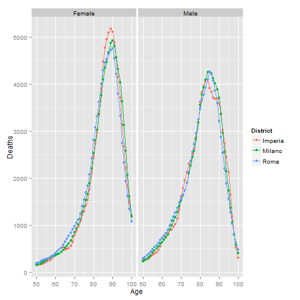

## Motivation

It is somehow interesting(!) what is your life expentancy and death probability around your country of origin...

Data has been retrieved from the official statistical Italian institution [Istat](http://www.istat.it).

Among different years, I chose 2012; the entre dataset can be downloaded [here](http://demo.istat.it/unitav2012/download.html)


---  

## Observations

 1. Survivors is the number of those surviving to exact age x from the initial generation of 100.000 births
 2. Deaths is the number of deaths occurring to the population in age group from x to x+1
 3. Expectation of life denotes the average expectation of life of a group of survivors on reaching age x.
 4. Probability of surviving is the probability that a person of exact age x (as per lived years at the date of January 1 st of the reference year) survives for one year 


--- 


## Results

I tried to use different Shiny and R functionalities in order to create an interactive application.
 
 1. Shiny templates (fluidpage, sidebarLayout, tabsetPanel,...)
 2. Shiny inputs/outputs (uiOutput, selectInput, selectizeInput, sliderInput, plotOutput, tableOutput...)
 3. ggplot2 (Facets, Aesthetics, ...)
 
 A sample plot can be created as:
  
  
  ```r
  data <- read.csv("datiprovincialicompleti2012.csv")
  selectedData <- data[data$District %in% c("Milano", "Roma", "Imperia"), ]
  selectedData <- selectedData[selectedData$Sex %in% c("Male", "Female"), ]
  selectedData <- selectedData[selectedData$Age >= 50 & selectedData$Age <= 100, c("Age", "Deaths", "District", "Sex")]
  g <- ggplot(aes_string(x = "Age", y = "Deaths"), data = selectedData) + facet_grid(. ~ Sex) + geom_line(aes(color = District)) + geom_point(aes(color = District))
  ```

--- .class #id 


## Results (cont.)

 


